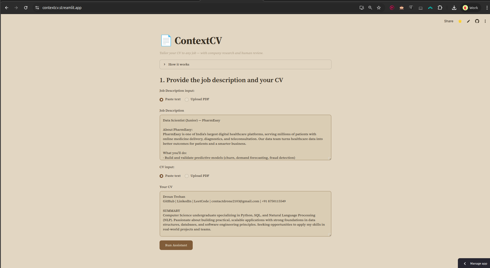
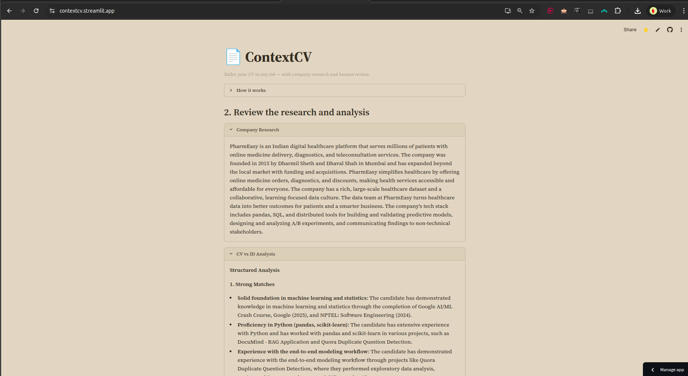
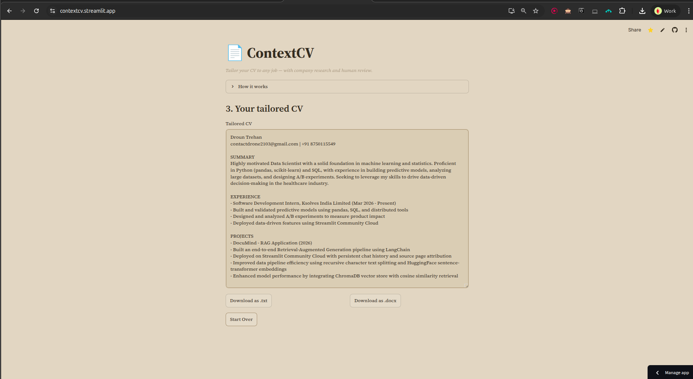

# ContextCV

> Multi-agent system that researches a company and tailors your CV to a specific job description — with human-in-the-loop review.

ContextCV takes a job description and your CV, researches the hiring company on the web, analyzes how your background maps to the role, and produces a tailored CV you can download as `.txt` or `.docx`. A human approval gate sits between analysis and final writing, so you stay in control.

**Live demo:** [contextcv.streamlit.app](https://contextcv.streamlit.app) · Built with LangGraph, Groq, and Streamlit.

## Demo

**1. Provide a job description and your CV**


**2. Review the research and analysis, then approve**


**3. Get your tailored CV**


---

## What it does

1. **Research** — an agent searches the web to learn about the target company (business, products, tech stack, culture).
2. **Analyze** — an agent compares your CV against the job description, surfacing strong matches, gaps, and what to emphasize.
3. **Review (you)** — the run pauses. You read the research and analysis, then approve before anything is written.
4. **Write** — an agent produces a tailored CV as structured data, exported to a clean `.docx` (and `.txt`).

---

## Architecture

A LangGraph state machine coordinates four roles. A **deterministic supervisor** routes work based on what's complete in state — research, then analysis, then writing — and stops when done.

```
            ┌──────────────┐
   START ─▶ │  supervisor  │ ◀─────────────┐
            └──────┬───────┘               │
        ┌──────────┼────────────┐          │
        ▼          ▼            ▼          │
   ┌─────────┐ ┌─────────┐ ┌─────────┐     │
   │researcher│ │analyzer │ │ writer  │ ────┘
   └────┬─────┘ └─────────┘ └─────────┘
        │ (web search tool loop)
        ▼
   ┌──────────────┐
   │ ToolNode     │  DuckDuckGo search
   └──────────────┘

   [interrupt_before: writer]  ◀── human approval gate (HITL)
```

**Design decisions worth noting:**

- **Deterministic routing over an LLM supervisor.** The routing logic ("is research done?") is a simple state check, so it's implemented in plain Python — faster, free, and 100% reliable. LLMs are reserved for the work that needs judgment (research, analysis, writing), not control flow.
- **Structured output for the writer.** The writer returns a typed Pydantic object (name, summary, sections, bullets), not freeform text. This makes `.docx` generation deterministic — real headings and bullets, not a text dump.
- **Human-in-the-loop via checkpointing.** `interrupt_before=["writer"]` pauses the graph; the Streamlit UI reads the paused state and resumes on approval. The graph holds the pause; the UI tracks which step to show.
- **Model-agnostic.** Runs on free-tier Groq Llama models by default; swap one line in `config.py` to use a larger model for higher-quality output.

---

## Tech stack

| Layer            | Tool                                   |
|------------------|----------------------------------------|
| Orchestration    | LangGraph                              |
| LLM inference    | Groq (Llama 3.1 / 3.3)                 |
| Web search tool  | DuckDuckGo                             |
| Observability    | LangSmith                              |
| Frontend         | Streamlit                              |
| Document export  | python-docx, pypdf                     |
| Packaging        | Docker                                 |

---

## Project structure

```
ContextCV/
├── src/
│   ├── config.py      # models, tools, env setup
│   ├── state.py       # graph state + Pydantic schemas
│   ├── agents.py      # supervisor, researcher, analyzer, writer
│   └── graph.py       # graph wiring, checkpointer, HITL
├── samples/           # sample CVs and JDs for testing
├── streamlit_app.py   # frontend entry point
├── requirements.txt
├── Dockerfile
└── .gitignore
```

---

## Running locally

```bash
# 1. Clone
git clone https://github.com/maybedrone/ContextCV.git
cd ContextCV

# 2. Create environment
python3 -m venv venv
source venv/bin/activate
pip install -r requirements.txt

# 3. Set API keys (get free keys from console.groq.com and smith.langchain.com)
export GROQ_API_KEY="your_key"
export LANGCHAIN_API_KEY="your_key"

# 4. Run
streamlit run streamlit_app.py
```

Open `http://localhost:8501`.

### With Docker

```bash
docker build -t contextcv .
docker run -p 8501:8501 \
  -e GROQ_API_KEY="your_key" \
  -e LANGCHAIN_API_KEY="your_key" \
  contextcv
```

---

## Observability

Every run is traced in LangSmith — each agent's input/output, the web-search queries, token counts, and latency. End users see only the final CV; the full internal chain is visible in the LangSmith dashboard for debugging and quality monitoring.

---

## Known limitations

- Default free-tier models (Llama 3.1 8B) occasionally produce surface-level tailoring or malform tool calls; the app handles these errors gracefully and retries. Larger models (Llama 3.3 70B, GPT-4) improve quality with no code changes.
- PDF text extraction works well for standard layouts; heavily designed multi-column CVs may extract imperfectly.
- `.docx` formatting is clean but minimal (headings + bullets); richer styling is a planned improvement.

---

## Roadmap

- Cover-letter generation
- Multiple tailored CV variants to choose from
- Richer `.docx` templating
- JD ingestion directly from a URL

---

Built by [Droun Trehan](https://github.com/maybedrone).
